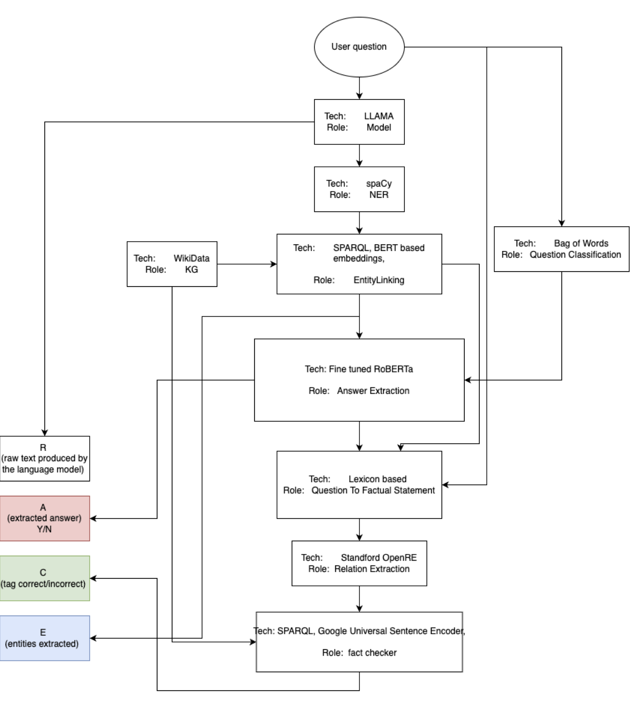

<p align="center">
    <h1 align="center">XM_40020-WebDataProcessingSystems</h1>
</p>
<p align="center">
    <em><code>► Full AI (NLP) pipeline to fact check a LLM (LLaMa) output against a knowledge graph (WikiData) </code></em>
</p>
<p align="center">
	
	
	
	
<p>
<p align="center">
		<em>Developed with the software and tools below.</em>
</p>
<p align="center">
	
	
	
	
	
	<br>
	
	
	
	
	
</p>
<hr>

##  Quick Links

> - [ Overview](#-overview)
> - [ Run container](#-run-container)
> - [ Repository Structure](#-repository-structure)
> - [ Modules](#-modules)
> - [ Getting Started](#-getting-started)
>   - [ Installation](#-installation)
>   - [Running the code](#-running-the-code)
> - [ Acknowledgments](#-acknowledgments)

---

##  Overview

The project implements a pipeline to fact check the answer of a LLM (LLaMa) by using Wikidata as a knowledge base.

Given an input file in the format: We will return a file with formatting: [R,A,C,E] Where: "R" has the value the raw text produced by the language model.

"A" has the extracted answer distilled from the LLM answer.

"C" is the tag correct/incorrect, the outcome of the fact checking.

"E" are the entities extracted and linked to Wikipedia, both from question and answer.

Further technical details can be found in "Final Report.pdf" Be aware: all the project data and files can be found in the /sharedFolder of the docker container, we write nowhere else.

The whole AI pipeline is the following:
<p align="center">
    
</p>

---

## Run container

In order to run the image of the project you will need to pull the docker image and run the interactiveDemo.py script:
```bash
  # From your machine
  docker pull leodom01/webdataprocessingsystems_factchecker
  docker run -it leodom01/webdataprocessingsystems_factchecker /bin/bash
  # Within the container
  cd /sharedFolder
  python3 interactiveDemo.py 
```
The scripts use by default input and output file: task_data/example_input.txt and task_data/example_output.txt .
In case you want to use different input and output files you can run:
```bash
  # Within the container
  python3 interactiveDemo.py /sharedFolder/task_data/my_input.txt /sharedFolder/task_data/my_output.txt
```
To copy files from your local machine you can use:
```bash
  # From your machine
  docker cp ./inputfile.txt CONTAINER:/sharedFolder/task_data/my_input.txt
```

---

##  Repository Structure

```sh
└── XM_40020-WedDataProcessingSystems/
    ├── .github
    │   └── workflows
    │       └── docker-build.yml
    ├── Dockerfile
    ├── README.md
    ├── buildAndStartContainer.sh
    ├── interactiveDemo.py
    ├── requirements.txt
    ├── src
    │   ├── AnswerExtraction.py
    │   ├── EntityLinking.py
    │   ├── FactChecking.py
    │   ├── IOHandler.py
    │   ├── NER.py
    │   ├── OpenRE.py
    │   ├── PostProcessPipeline.py
    │   ├── PreProcessor.py
    │   ├── QuestionClassification.py
    │   ├── QuestionToStatement.py
    │   └── utils.py
    └── task_data
        ├── dataset_in.txt
        ├── dataset_out.txt
        ├── example_input.txt
        └── example_out.txt
```

---

##  Modules

<details open><summary>.</summary>

| File                                                                                                                             | Summary                         |
| ---                                                                                                                              | ---                             |
| [requirements.txt](https://github.com/Leodom01/XM_40020-WedDataProcessingSystems/blob/master/requirements.txt)                   | <code>► Required pip modules</code> |
| [Dockerfile](https://github.com/Leodom01/XM_40020-WedDataProcessingSystems/blob/master/Dockerfile)                               | <code>► Dockerfile to build the container image</code> |
| [interactiveDemo.py](https://github.com/Leodom01/XM_40020-WedDataProcessingSystems/blob/master/interactiveDemo.py)               | <code>► Main Python script to run the script</code> |
| [buildAndStartContainer.sh](https://github.com/Leodom01/XM_40020-WedDataProcessingSystems/blob/master/buildAndStartContainer.sh) | <code>► Script to build and start container locally</code> |

</details>

<details open><summary>src</summary>

| File                                                                                                                                 | Summary                         |
| ---                                                                                                                                  | ---                             |
| [PostProcessPipeline.py](https://github.com/Leodom01/XM_40020-WedDataProcessingSystems/blob/master/src/PostProcessPipeline.py)       | <code>► Main pipeline that implements the fact checking</code> |
| [OpenRE.py](https://github.com/Leodom01/XM_40020-WedDataProcessingSystems/blob/master/src/OpenRE.py)                                 | <code>► Standford Open Relation Extraction that gets the triples</code> |
| [QuestionToStatement.py](https://github.com/Leodom01/XM_40020-WedDataProcessingSystems/blob/master/src/QuestionToStatement.py)       | <code>► Semantical conversion from LLM answer to factual statement to fact check</code> |
| [IOHandler.py](https://github.com/Leodom01/XM_40020-WedDataProcessingSystems/blob/master/src/IOHandler.py)                           | <code>► I/O file writer/reader</code> |
| [EntityLinking.py](https://github.com/Leodom01/XM_40020-WedDataProcessingSystems/blob/master/src/EntityLinking.py)                   | <code>► Finds entity menstion references in WikiData</code> |
| [PreProcessor.py](https://github.com/Leodom01/XM_40020-WedDataProcessingSystems/blob/master/src/PreProcessor.py)                     | <code>► Preprocessing lib for stemming, lemmatization, tokenization...</code> |
| [NER.py](https://github.com/Leodom01/XM_40020-WedDataProcessingSystems/blob/master/src/NER.py)                                       | <code>► NER realized with SpaCy model for NER</code> |
| [utils.py](https://github.com/Leodom01/XM_40020-WedDataProcessingSystems/blob/master/src/utils.py)                                   | <code>► Project wide utils</code> |
| [QuestionClassification.py](https://github.com/Leodom01/XM_40020-WedDataProcessingSystems/blob/master/src/QuestionClassification.py) | <code>► Classifies question: entity, boolean, completion</code> |
| [FactChecking.py](https://github.com/Leodom01/XM_40020-WedDataProcessingSystems/blob/master/src/FactChecking.py)                     | <code>► Fact checker implemented with tensorflow sentence embedding against WikiData</code> |
| [AnswerExtraction.py](https://github.com/Leodom01/XM_40020-WedDataProcessingSystems/blob/master/src/AnswerExtraction.py)             | <code>► Answer extraction with fine tuned RoBERTa models</code> |

</details>

---

##  Getting Started

***Requirements***

Ensure you have the following dependencies installed on your system:

* **curl**
* **unzip**
* **git lfs**

###  Installation

1. Clone the XM_40020-WedDataProcessingSystems repository:

```sh
git clone https://github.com/Leodom01/XM_40020-WedDataProcessingSystems
```

2. Change to the project directory:

```sh
cd XM_40020-WedDataProcessingSystems
```

3. Run the build and startup script:

```sh
sh ./buildAndStartContainer.sh
```

###  Running the code

Open a shell on the container created:

```sh
docker exec -it <created_container> /bin/bash
```

Run the interactive demo:

```sh
cd sharedFolder/
python3 interactiveDemo.py
```

##  Acknowledgments

This project is part of the Web Data Processing System from Vrije Universiteit ( https://research.vu.nl/en/courses/web-data-processing-systems-2 ).

It is the group assignment usually completed by 4 students part of the MSc in Computer Science or AI.
The project and its presentation (not available here) has been graded 91/100, the overall project average is 65/100, the upper quartile is 80/100.

[**Return**](#-quick-links)

---
